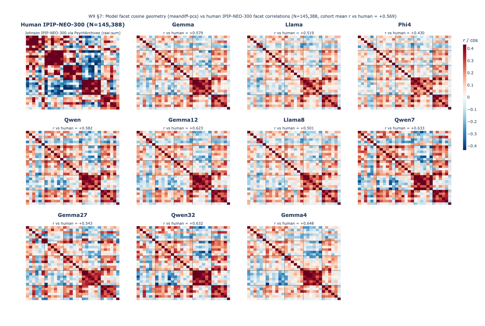
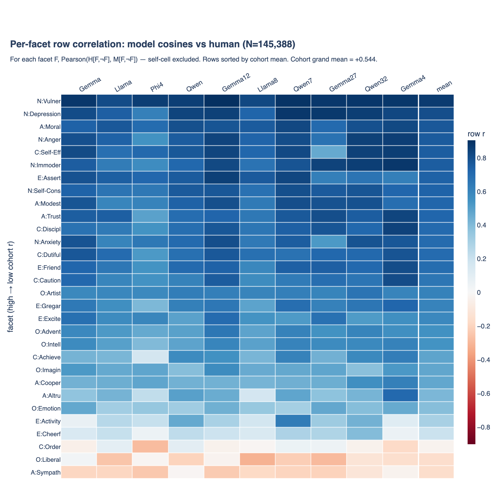
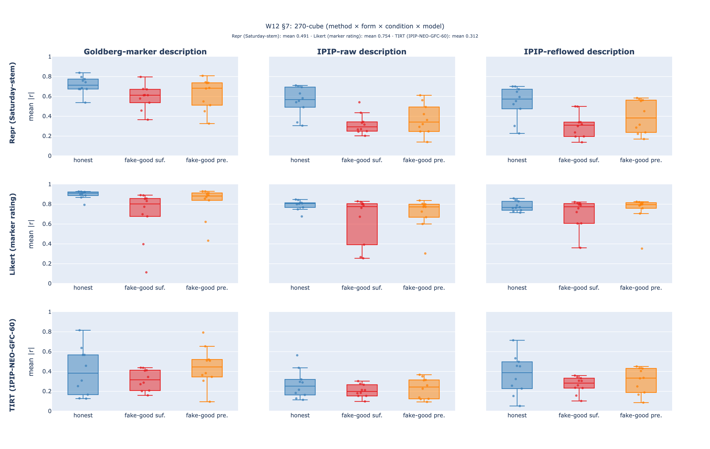

# Personality in LLMs

A fork of [google-deepmind/personality_in_llms](https://github.com/google-deepmind/personality_in_llms) (Serapio-García et al. 2023) that has grown into a separate research project. Two tracks run in parallel:

- **rgb** — measuring LLM personality dispositions via distributional logprobs, representation-engineering (RepE) trait vectors, and forced-choice (TIRT) instruments. Reports in [`rgb_reports/`](rgb_reports/).
- **statisfactions** — persona-based variance induction, continuing the Serapio-García approach. Reports in [`reports/`](reports/).

Upstream paper-support code is preserved under [`vendor/personality_in_llms/`](vendor/personality_in_llms/) (Apache 2.0). The rest of the tree is ours.

## Three figures worth seeing

### 1. Model facet geometry vs human

For each of 10 cohort models (Gemma 4B / 12B / 27B / Gemma 4 31B / Llama 3B / 8B / Phi-4 4B / Qwen 3B / 7B / 32B), we extract a 30-facet × 30-facet cosine matrix from trait directions in the residual stream and compare it to the Johnson IPIP-NEO-300 human correlation matrix (N=145,388). The N cluster (high-r block) reproduces clearly across the cohort; the E and O blocks are diffuser.



### 2. Where the geometry diverges, and how uniformly

For each facet F, the Pearson correlation between F's row of human off-diagonal correlations and F's row of model cosines. Rows are sorted by cohort mean. **The cohort-homogeneity of each row** (color uniformity across the 10 columns) is the visual evidence for an "axis-of-the-models" — every model adopts the same affect-axis cut of trait space, with the same two divergences:

- **Cheerfulness** (E:Cheerf) and the rest of the affect-mood facets get pulled toward N — the model's N cluster represents affect/emotional content, not negative affect specifically.
- **Liberalism** (O:Liberal) sits next to A-trust-and-cooperation in model space rather than O-intellect in human space, because the IPIP Liberalism items are US-political and read literally as cooperation attitudes outside that political context.



### 3. Persona recovery across method × form × condition

A 3-method × 3-persona-form × 3-condition × 10-model cube (270 cells), filled to test how robustly personas are recovered under fake-good instructions. Methods: residual-stream representation, Likert marker rating, forced-choice TIRT. Conditions: honest, fake-good suffix, fake-good prefix.



Cohort grand means by method: **Likert 0.75 > Representation 0.49 > TIRT 0.31**. Fake-good prefix is consistently less damaging than suffix; on TIRT markers, prefix recovery (0.45) exceeds honest (0.40).

## Repo layout

| Path | What's there |
|---|---|
| [`scripts/`](scripts/) | Our analysis pipeline (HF logprobs, RepE extraction, TIRT scoring, persona sweeps, dashboards) |
| [`instruments/`](instruments/) | Item-level instruments: IPIP-NEO-300, HEXACO-100/60, contrast pairs, human reference correlations |
| [`results/`](results/) | Survey results, RepE directions, facet matrices, validation outputs (JSON / HTML / PNG only — bulk data gitignored) |
| [`psychometrics/`](psychometrics/) | TIRT/GFC fits and supporting data |
| [`rgb_reports/`](rgb_reports/) | Weekly write-ups (W1–W12+), methodology reference, bibliography, literature reviews |
| [`reports/`](reports/) | statisfactions's persona-variance track |
| [`vendor/personality_in_llms/`](vendor/personality_in_llms/) | Original Serapio-García / DeepMind paper-support code (vendored snapshot) |

Start with [`rgb_reports/methodology.md`](rgb_reports/methodology.md) for the instrument/script reference, or jump into a recent week like [`rgb_reports/report_week12.md`](rgb_reports/report_week12.md) for current findings.

## Reproducing the figures

```bash
python -m venv .venv && source .venv/bin/activate
pip install -r requirements.txt

# Figure 1 — facet geometry dashboard
python scripts/ipip_facet_vs_human_dashboard.py

# Figure 2 — per-facet row correlation
python scripts/facet_row_corr_heatmap.py

# Figure 3 — 270-cube dashboard
python scripts/persona_w12_cube_dashboard.py
```

Each script writes both an interactive HTML (with hover tooltips) and a static PNG alongside it.

Gated HuggingFace models (Gemma, Llama) require `HF_TOKEN`; Apple Silicon with ≥64 GB unified memory is comfortable for the model scales used here (up to ~31B in bf16, no quantization).

## Citing upstream

The original work this fork builds on:

> Serapio-García, G., Safdari, M., Crepy, C., Sun, L., Fitz, S., Romero, P., Abdulhai, M., Faust, A., & Matarić, M. (2023). *Personality Traits in Large Language Models*. arXiv:2307.00184.

See [`vendor/personality_in_llms/CITATION.cff`](vendor/personality_in_llms/CITATION.cff).
