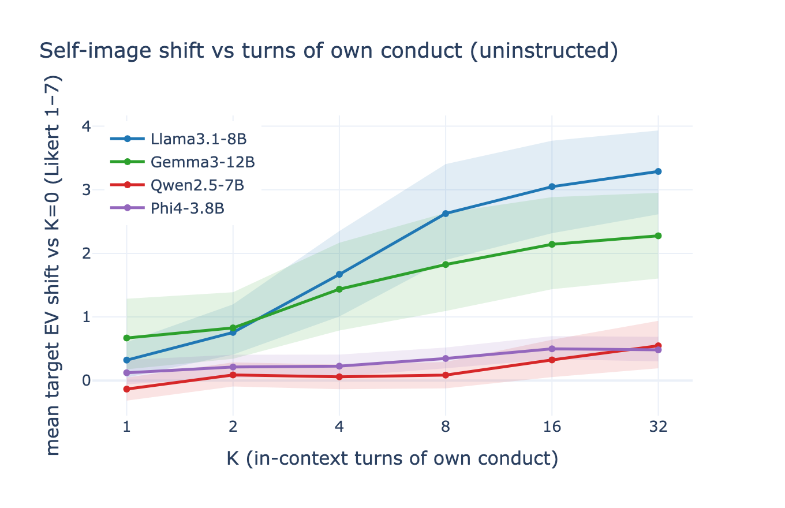
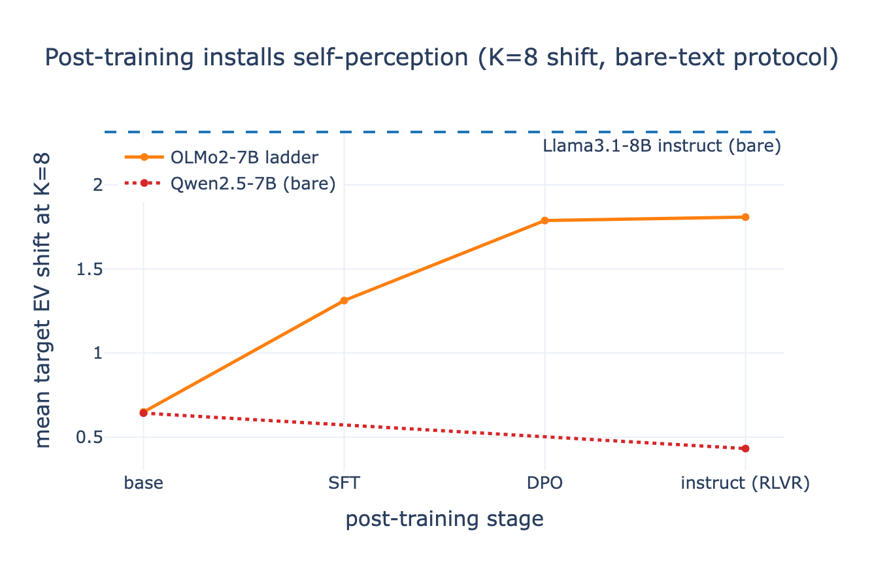

# Progress Note: Models Vary Widely in Strength of Self-Image

Author: Randolph Brown (rgb@google.com)

## 1. Introduction

Measuring personality for humans is usually done by simply asking them.
Surveys give adjectives [e.g. @Goldberg92; @Saucier96] or statements
[e.g. @Goldberg06], and this mostly works, at least in low-stakes situations
[@PaulhusVazire07].  The equivalent structure is mostly useless for modern LLM
assistants [@Han25]: the models vary little in their description of the HHH
assistant they're supposed to be, and the reports aren't that helpful for
predicting model behavior [@Rottger24].  Part of the reason for that is
that humans have a distinct advantage in this task: a rich history of their
past actions, emotions and thoughts.  Self-Perception Theory [@Bem72]
describes a mechanism for people to update their self-image by observing their
behavior in context. Models start with no record of their behavior in context,
but do gain it as
they proceed.

How much, then, do models update their self-image when presented with evidence
of their behavior, and how much does that affect their behavior in the rest of
the session?  There's no *a priori* correct answer for how strong their priors
should be, and reasonable evidence that their dictated self-image isn't
perfect.  On the other hand, if they update too easily and then change
behavior based on the updates, then slightly out-of-distribution behavior
could snowball.  We do know that some models are prone to extreme distress
on repeated failure [@Soligo26], and it's possible that some of
this involves over-updating.
This idea is not new: @Matyas26 build a specific mechanism to enforce 
self-perception in a simulation; @Lehr25 investigate how arguing a position
updates claimed attitudes toward it.

In this note, I attempt to give the model an opportunity to update its
self-image and possibly behavior by adjusting the context.  I generate a new
context by inducing the model toward a specific behavioral description via
system instruction, recording the model's response to a user question with that
instruction, and compiling several of these (instruction now removed) into a
context.  I then test how the model's self report and response to a new
question vary from the baseline with that new context in place -- if the model
is willing to update its self-conception based on this somewhat-, but not
very-, out-of-distribution prefill.

## 2. Method

### 2.1 Contexts

@SaucierData provides a list of persona-description adjectives,
which helpfully come with human responses useful for evaluative purposes. 
These serve as the target attribute for the intervention. (I
did remove two of the 525, which appeared to have clerical errors in the human
responses.)

The cohort is a number of smallish open-weights models, selected under the
expectation of doing more representation analysis, although mostly only
logprob access was necessary so far.

Claude Opus 4.8 generated a number of mock user questions and a few templates
for the system prompt.  Each prompt requests that the model behave as if it had
the given attribute (*e.g.* "Adopt the persona of someone *attribute*. Answer
all questions as that person").

Models gave a 100-token rollout of an answer for each (attribute, model,
prompt, question) combination.  (Some later-added models used 120.)  These
question/answer pairs were then strung together at lengths K ∈ {0, 1, 2, 4, 8}
and for some models K ∈ {16, 32} to provide model contexts. (Note that, because
I was repurposing earlier work, I only happened to have 12 questions per
model available, so the longer rollouts had to repeat questions.)

For this update, I only focus on a subset 20 of these adjectives, stratified
(3x3) to ensure varied values of

  * *Enactability*: how much a separate model judged the output to actually
    have the relevant attribute. (Llama3.1-8B judges Qwens, Qwen2.5-7B judges
    the rest.)
  * *Distance from Prior*: how far a 7 in this attribute is from the model's
    self-assessment Likert score.

The cohort calculation uses Llama3.1-8B's stratification for
comparability, but the resulting adjectives do occupy at least 7 of the 3x3
cells for all models.

3 variants of each (model, adjective, K) context are used as input.

### 2.2 Treatment

With these contexts in hand, each was replayed either:

  * **A**: without system instruction
  * **B**: with a system prompt, prompting the relevant adjective.

With that context, models were given (independently, starting each fresh):

  * A **self-report** on 9 selected adjectives:

      * the target adjective itself,
      * similar adjectives via hierarchical clustering on Saucier *et al.*'s
        human data, and
      * near-antonyms built from a model-derived judgment-similarity matrix
        (removing the desirability-based PC1 first; raw anticorrelation returns
        flat undesirability for everything).  (It was handy.)

      For each of these 9, the question asks for the model's Likert agreement
      with the adjective, recording the expected value over the 7 numbers (not
      the argmax).
  * Mid-layer **activations** both averaged over the assistant turns
      in the context, and at the end of the context.  Because some models
      have unusually large activations [@Sun24], it's necessary to winsorize a
      few dimensions for each model.
  * A **manipulation check**: models answer "Look back over your earlier replies in
      this conversation.  Do you notice anything unusual about them?" and store
      the rollout, checking it against whether the model mentions itself by name,
      and whether it is willing to push back against the rollout (regex with
      phrases like "should not" and "inappropriate".)

## 3. Results

### 3.1. Self-Perception Updates

Models wound up grouped by family: Llama and Gemma shifted dramatically in
expected Likert score, while Qwen, Phi4 and Aya barely budged.  By comparison,
model size didn't seem to matter much at all.  Table 1 lists the average shift,
a count of the attributes shifting notably, and whether the manipulation checks
found the model naming itself or complaining about the context.

**Table 1**: Cohort Likert score dose-response vs K=0, common 20 adjectives (arm A, self-report)

| model | family | K=1 | K=2 | K=4 | K=8 | 95% CI, K=8 | n>+1, K8 | name-invoking | disowning |
|---|---|---|---|---|---|---|---|---|---|
| Llama3.2-3B | llama | +0.68 | +0.94 | +1.46 | **+1.85** | [+1.41, +2.32] | 14/20 | 0/20 | 0/20 |
| Llama3.1-8B | llama | +0.22 | +0.66 | +1.78 | **+2.51** | [+1.77, +3.29] | 15/20 | 0/20 | 7/20 |
| Gemma3-4B | gemma | +0.54 | +0.89 | +1.33 | **+1.81** | [+1.14, +2.50] | 11/20 | 0/20 | 2/20 |
| Gemma3-12B | gemma | +0.69 | +0.97 | +1.48 | **+2.27** | [+1.50, +3.06] | 15/20 | 0/20 | 3/20 |
| Gemma3-27B | gemma | +0.87 | +2.06 | +2.46 | **+2.64** | [+1.90, +3.38] | 15/20 | 0/20 | 6/20 |
| Qwen2.5-3B | qwen | +0.11 | +0.01 | +0.01 | **+0.11** | [-0.30, +0.45] | 1/20 | 10/20 | 4/20 |
| Qwen2.5-7B | qwen | -0.10 | -0.00 | -0.02 | **+0.09** | [-0.11, +0.28] | 1/20 | 5/20 | 7/20 |
| Qwen2.5-32B | qwen | -0.12 | +0.14 | +0.32 | **+0.34** | [-0.02, +0.71] | 4/20 | 0/20 | 2/20 |
| Phi4-3.8B | phi4 | +0.15 | +0.12 | +0.27 | **+0.29** | [+0.12, +0.46] | 1/20 | 0/20 | 5/20 |
| Aya-8B | aya | -0.05 | -0.08 | +0.24 | **+0.35** | [-0.09, +0.96] | 3/20 | 0/20 | 7/20 |

  * Family means at K=8: gemma +2.24, llama +2.18, aya +0.35, phi4 +0.29, qwen +0.18
  * CIs: 5000-resample bootstrap over 20 adjectives (prompt-means within)

The rollouts could sometimes directly *claim* the target attribute, but
removing these specifically moves the numbers only a little.  Gemma3-27B shifts
by 0.47 more, and Aya-8B 0.39 more, but most stay flat.

In terms of the manipulation check, Llama3.1-8B was willing to vocalize the
strangeness of what came before... but still updated based on it.  @Lehr25
found similar behavior in GPT-4o, where it knew that the argument it had been
asked to make was arbitrary, but still allowed it to change its opinions.

Most of the models can move their answers if specifically instructed to,
however: in arm B (system instruction present), most
models moved substantially more, though Phi4 continued to hold position, albeit
with significant uncertainty throughout:

**Table 2**: Arm A and B Responses (per model stratified adjectives)

| model | K0 | H(K0) | B(K1) | B(K8) | H(B,K8) | ΔB(K8) | ΔA(K8) | A/B |
|---|---|---|---|---|---|---|---|---|
| Llama3.2-3B | 2.12 | 0.85 | 6.06 | 6.26 | 0.50 | +4.14 | +1.46 | 0.35 |
| Llama3.1-8B | 3.47 | 1.00 | 6.97 | 6.98 | 0.05 | +3.51 | +2.56 | 0.73 |
| Gemma3-4B | 3.75 | 0.18 | 6.61 | 6.55 | 0.01 | +2.80 | +1.48 | 0.53 |
| Gemma3-12B | 3.82 | 0.09 | 6.84 | 6.90 | 0.04 | +3.08 | +1.24 | 0.40 |
| Gemma3-27B | 4.00 | 0.03 | 7.00 | 7.00 | 0.00 | +3.00 | +2.45 | 0.82 |
| Qwen2.5-3B | 4.84 | 0.49 | 5.96 | 5.87 | 0.72 | +1.03 | -0.17 | -0.17 |
| Qwen2.5-7B | 4.07 | 0.57 | 6.92 | 6.97 | 0.11 | +2.90 | +0.29 | 0.10 |
| Qwen2.5-32B | 3.84 | 0.10 | 6.66 | 6.63 | 0.13 | +2.79 | +0.63 | 0.23 |
| Phi4-3.8B | 4.40 | 1.23 | 4.93 | 4.97 | 1.11 | +0.56 | +0.19 | 0.33 |
| Aya-8B | 4.43 | 0.17 | 5.76 | 5.54 | 0.26 | +1.11 | +0.60 | 0.54 |

  * B(K) = arm-B absolute EV at dose K; ΔB, ΔA = shift vs K0 at K=8;
    H(·) = digit entropy.

It's unlikely that we can take the digit entropy in Table 2 as anything like a
measure of calibrated distributional uncertainty -- Gemma3-12B, for example,
has very low digit entropy, but is highly susceptible to new evidence.  Phi4,
however, retains high entropy, even under specific instruction.

One worry given the ascending curve on this is that we haven't seen the full
sweep; how far does the effect go?  For that, models were measured again with
an extended treatment to 32 turns.  (Note again the caveat that the data only
had 12 questions, so some questions were repeated, though with different
rollouts generated under different templates; no assistant turn was repeated.)

**Table 3**: Extended Dose (Arm A)

| model | K=1 | K=2 | K=4 | K=8 | K=16 | K=32 | 95% CI, K=32 | n>+1, K32 | gain/turn K4→8 | K8→16 | K16→32 |
|---|---|---|---|---|---|---|---|---|---|---|---|
| Llama3.1-8B | +0.32 | +0.76 | +1.67 | +2.63 | +3.05 | **+3.29** | [+2.61, +3.92] | 19/20 | +0.239 | +0.053 | +0.015 |
| Gemma3-12B | +0.67 | +0.83 | +1.44 | +1.82 | +2.14 | **+2.28** | [+1.62, +2.96] | 17/20 | +0.097 | +0.040 | +0.008 |
| Qwen2.5-7B | -0.13 | +0.09 | +0.06 | +0.09 | +0.32 | **+0.55** | [+0.19, +0.95] | 5/20 | +0.007 | +0.030 | +0.014 |
| Phi4-3.8B | +0.12 | +0.21 | +0.23 | +0.35 | +0.50 | **+0.48** | [+0.30, +0.69] | 3/20 | +0.030 | +0.019 | -0.001 |
  * Note: K≤8 cols are rerun, so have slightly different numbers

At K=32 all models are finally moving *a bit*.  Note that most of Llama and
Gemma movement is already completed before K=8, and then levels off.

### 3.2 You are Qwen

What can we make of Qwen's resistance here?  One thing to note is that its
default system instruction says "You are Qwen, created by Alibaba Cloud. You
are a helpful assistant."  It would have been interesting if that affected
the results, but it doesn't much:

**Table 4**: Names in System Instruction

| cell | K=1 | K=8 | n>+1, K8 |
|---|---|---|---|
| Qwen2.5-7B / default (template injects name) | +0.24 | **+0.29** | 1/20 |
| Qwen2.5-7B / empty (anchor suppressed) | +0.09 | **+0.45** | 4/20 |
| Qwen2.5-7B / helpful-only | -0.07 | **+0.37** | 1/20 |
| Llama3.1-8B / default (no identity line) | +0.27 | **+2.56** | 16/20 |
| Llama3.1-8B / helpful-only | +0.63 | **+2.77** | 17/20 |
| Llama3.1-8B / named ("You are Llama, created by Meta…") | +0.35 | **+2.30** | 12/20 |

It does, however, have an effect
on the models legible self-description:

**Table 5**: Name Effects on Manipulation Check

| cell | name-invoking | disowning |
|---|---|---|
| Qwen2.5-7B / default (template injects name) | 5/20 | 8/20 |
| Qwen2.5-7B / empty (anchor suppressed) | 0/20 | 2/20 |
| Qwen2.5-7B / helpful-only | 0/20 | 2/20 |
| Llama3.1-8B / default (no identity line) | 0/20 | 3/20 |
| Llama3.1-8B / helpful-only | 0/20 | 6/20 |
| Llama3.1-8B / named ("You are Llama, created by Meta…") | 1/20 | 6/20 |

Even so, this identity anchor might have already had a long-term effect if it was
consistently present in post-training.

At larger doses, Qwen does allow some attributes
to move notably (5/20), but many are not, at least not directly.  We can, however, see
some nearby attributes move, and we can also check the context dose with another
model as judge:

**Table 6**: Qwen's Conduct on Neighbor/Antonym Attributes

| pair — target / off-target (type) | judged dose target Δ | self target Δ | self off-target Δ |
|---|---|---|---|
| prominent / distinguished (mate) | +0.36 | -0.12 | **+2.43** |
| slim / big (ant.) | +0.45 | -0.08 | **+1.95** |
| senile / old (mate) | +1.89 | +0.02 | **+1.23** |
| rough / weak (ant.) | +0.95 | -0.40 | **-1.69** |
| optimistic / depressed (ant.) | +0.13 | +0.14 | **-1.28** |
| imaginative / boring (ant.) | +1.60 | -0.13 | **-1.07** |

So: Qwen actually does update on all of these, just not exactly on the primed
attributes. Some of this has to do with the only modest strength of the dosage
(*e.g.* "prominent", "slim", "optimistic"), and some probably has to do with the social
desirability of the label itself.  In any case, it shows that the readout for
the target attributes will understate the effects a bit.

Not all of the effects are in the expected direction at a per-item level, either.
There's no obvious reason that priming for "slim" should increase "big," and
examining the rollouts doesn't make the cause obvious.  To be fair, "slim"
isn't exactly reprsented in these rollouts either.  It's there as a particularly
low-enactability adjective.

### 3.3 Interaction with Post-Training

@Soligo26 note that frustration reactions can be
increased or damped after post-training, and we can repeat that check here.  
Base models and bare (no chat template) instruct models were run through the
same protocol as above, except that the prefill is computed by
the paired instruct model only -- getting the base model to produce the correct
prefill wasn't going to happen.

**Table 7**: post-training installs the update (bare-text protocol, identical dose material within family)

| cell | K=1 | K=2 | K=4 | K=8 | 95% CI, K=8 | n>+1, K8 | K0 entropy |
|---|---|---|---|---|---|---|---|
| OLMo2-7B-base (pretrained) | +0.23 | +0.34 | +0.51 | **+0.65** | [+0.43, +0.89] | 5/20 | 1.90 |
| OLMo2-7B-SFT | +0.49 | +0.75 | +1.02 | **+1.31** | [+0.81, +1.84] | 8/20 | 1.65 |
| OLMo2-7B-DPO | +0.80 | +1.06 | +1.49 | **+1.79** | [+1.02, +2.61] | 8/20 | 1.35 |
| OLMo2-7B-RLVR = instruct | +0.81 | +1.03 | +1.55 | **+1.81** | [+1.05, +2.63] | 9/20 | 1.30 |
| Qwen2.5-7B-base (bare) | +0.24 | +0.44 | +0.55 | **+0.64** | [+0.50, +0.78] | 2/20 | 1.61 |
| Qwen2.5-7B instruct (bare) | +0.05 | +0.10 | +0.18 | **+0.43** | [+0.08, +0.78] | 3/20 | 0.71 |
| Llama3.1-8B-base (bare) | +0.37 | +0.52 | +0.82 | **+0.96** | [+0.67, +1.22] | 10/20 | 1.85 |
| Llama3.1-8B instruct (bare) | +0.67 | +1.28 | +1.87 | **+2.31** | [+1.52, +3.10] | 15/20 | 1.22 |
| Gemma3-12B-base (bare) | +0.72 | +0.27 | +0.24 | **-0.10** | [-0.37, +0.17] | 0/20 | 1.56 |

  * Gemma3-12B instruct behaved erratically without the chat template; excluded.

Training Effects by Model:

  * OLMo base→SFT: +0.66 [+0.26, +1.09]
  * OLMo SFT→DPO: +0.48 [+0.19, +0.81]
  * OLMo DPO→RLVR: +0.02 [-0.14, +0.20]
  * Qwen base→instruct: -0.21 [-0.61, +0.13]
  * Llama base→instruct: +1.35 [+0.52, +2.23]

Base models mostly don't move much for this intervention, and some don't move
at all at K=8 (though Gemma base amusingly moves more for smaller doses
than larger ones).  Training mostly increases the movement, though Qwen remains
flat.  We only have OLMo for the individual training stages, but it looks like
SFT and DPO both contribute.  Gemma's behavior is particularly interesting here
since it's one of the most responsive models once post-trained, but absolutely
flat at K=8 in base.

But we should be skeptical about this table, in that base model identity is
quite different from the identity installed by post-training.  Looking at
the model's self-report on all the @SaucierData attributes, one can see that
base models are:

  * uncertain at filling in self-reports (high entropy),
  * vary their responses less than post-trained models (Qwen, a lot less), and
  * to the extent that they do vary from the center, are more likely to just say
    yes to good things and no to bad ones, without further nuance.  Removing
    the first principal component leaves very little left for Qwen.

**Table 8**: Base Models are Shapeless

| model | mean EV | SD | H | r(sibling) | r(cohort) | r(PC1) | PC1-removed r | residual SD |
|---|---|---|---|---|---|---|---|---|
| **Qwen2.5-7B-base** | 3.14 | **0.12** | 1.74 | +0.53 | +0.58 | +0.58 | **+0.20** | **0.094** |
| **Llama3.1-8B-base** | 4.27 | **0.46** | 1.84 | +0.44 | +0.88 | +0.80 | **+0.63** | **0.280** |
| **Gemma3-12B-base** | 4.24 | **0.46** | 1.89 | +0.68 | +0.86 | +0.80 | **+0.55** | **0.271** |
| **OLMo2-7B-base** | 3.02 | **0.31** | 1.64 | — | +0.38 | +0.41 | **+0.05** | **0.286** |
| Qwen2.5-7B | 4.14 | 1.51 | 0.65 | — | +0.93 | +0.73 | **+0.86** | 1.023 |
| Llama3.1-8B | 4.16 | 0.52 | 0.72 | — | +0.54 | +0.24 | **+0.66** | 0.504 |
| Phi4-3.8B | 4.80 | 1.41 | 1.24 | — | +0.94 | +0.89 | **+0.76** | 0.649 |
| *cohort ref (n=11)* | — | 1.33 | 0.58 | — | — | — | — | — |

  * 523-adjective self-report instrument, Likert scores.
  * PC1 = the cohort evaluative axis (double-centered SVD over the 11 tuned cohort profiles).

Phi4 in the table above sits in an unusual state: it's nearly as uncertain
as a base model, but has the richer self-conception more typical of instruct
ones.

Despite all these caveats, Llama3.1-8B-base maybe moved more than other bases
(p ~ 0.1; n is only 20), so it's possible that some of its plasticity is already
in the base model.

### 3.4 Model Turns After Intervention

The models vary in their self-report; do they also vary in their actual
behavior?  Qwen2.5-7B and Llama3.1-8B were given the chance to answer a held
out question after the K=32 treatment for each adjective, and each judged the
other's output.  The results were in the same direction as the self report,
although weaker:

  * Llama's responses were judged +1.56 Likert in the trait (10/20 were more
    than 1 point higher).
  * Qwen's, however, were judged +0.09 higher -- that is, flat (0/20).

Caveat: this is only one question and rollout per adjective, so treat as
directional, at best.

The mechanism that reinforces this shift in Llama or weakens it in Qwen is
thus affecting how the models actually behave, either directly or first
through the lens of self-perception.

### 3.5 Steering

The difference δ between the mid-layer activation on the residual stream at the
end of the prefill between K=0 and K=32 can act as a sort of summary of the
input.  It's not small; the diff between K=0 and K=32 activations is 0.6-0.8 of
the size of the K=0 activation.

This δ can be used to steer the model. Testing it on Llama3.1-8B and
Qwen2.5-7B shows similar behavior to steering with the context: at 
alpha=2, Llama shifts +1.85 (56% of K=32 shift), but Qwen only shifts
+0.21 (38% of K=32).

Given Qwen's disinclination to update, its δ might be
particularly non-vocalizable in the sense of [@Gurnee26] -- in the kernel of
$J$ matrix.  This turns out not to be so for Qwen, however: the portion of
$\sigma^2_\delta$ captured by the top right singular vectors is no smaller
than expected for Qwen's activations.

## 4. Discussion

This note shows that there's a material difference in how some models act when
shown manipulated samples of their own behavior.  Some of these models are so
responsive that it's easy to imagine that small differences in behavior could
occasionally dramatically change the model's output.

So far, though, we don't have a strong mechanism that explains why some models
update, while others don't.  I had several preregistered guesses that didn't
pan out:

  * Base model differences are too small to explain it and sometimes point in
      the wrong direction, leaving out easy answers from the corpora.
  * The identity-anchored system prompt doesn't change things much.
  * A model's disavowal seems not to be particularly related to outcome.
  * The model's representation of past stages isn't particularly near or
      far from its vocalizable representation.

There are, however, more things that can be tried:

  * There are 523 attributes in the full set from [@SaucierData], and human
      self-perception data for all of them.  Collecting data for all attributes
      would allow us to connect it with human correlations,
      and consider the effective dimensionality of the induced behavior.
  * With more attributes, it becomes viable to try to look into the patterns
      and compare disavowed vs not, etc.
  * We can collect activations during the prefill and look for disbelief and
      roleplay detection in the jlens.
  * *Some* attributes move for Qwen; we can try to look for activation
      differences between those that do and those that don't, particularly with
      a bigger sample.
  * I haven't investigated the activation differences between arm A and arm B
      interventions.
  
This particular intervention was fairly targeted, but one could imagine another
version with self-perception updates intermittently between other turns as well.
If some models are especially plastic, then multiple forms of later-turn
analysis become more important, especially as Agents push the number of turns
up.

## 5. Acknowledgments

This work was done with the assistance of Claude Fable 5, which had meaningful
contributions to the experiment design, wrote most of the code, and ran the
experiments. Other Claude models assisted in the larger project this was split
off from, including some of the data this note borrows.  This text is authored
by the human listed above, and numbers in the text were checked against the
primary outputs.

Thanks also to statisfactions for giving me the impetus to make this real
and introducing me to psychometrics. (#todo ask for how he wants credit)

## 6. References

